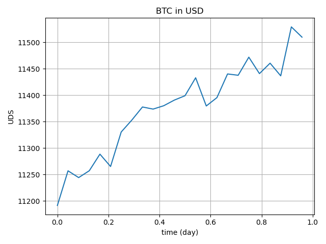

# Binance price prediction

The purpose of this project is to produce a model capable of realizing price prediction for a given crypto-currency using **Binance** API for data retrieval.

Ideally multiple models will be produced, operating on their own time frame (weeks, days, seconds) to be able to spot broad tendencies as well as short fluctuations. 

This should be the base for creating an efficient trading bot.

## Data analysis

### First dataset

Only 23 hours of data with a laps of `00:57:30`  between points, starting from `2020-08-27 20:00:00 `.

The goal of retrieving this dataset is to test **Binance** Api function : `get_historical_klines("BTCUSDT", Client.KLINE_INTERVAL_1HOUR, "1 day ago UTC")`.

The limit of data retrieved with one call is **1000 rows**.